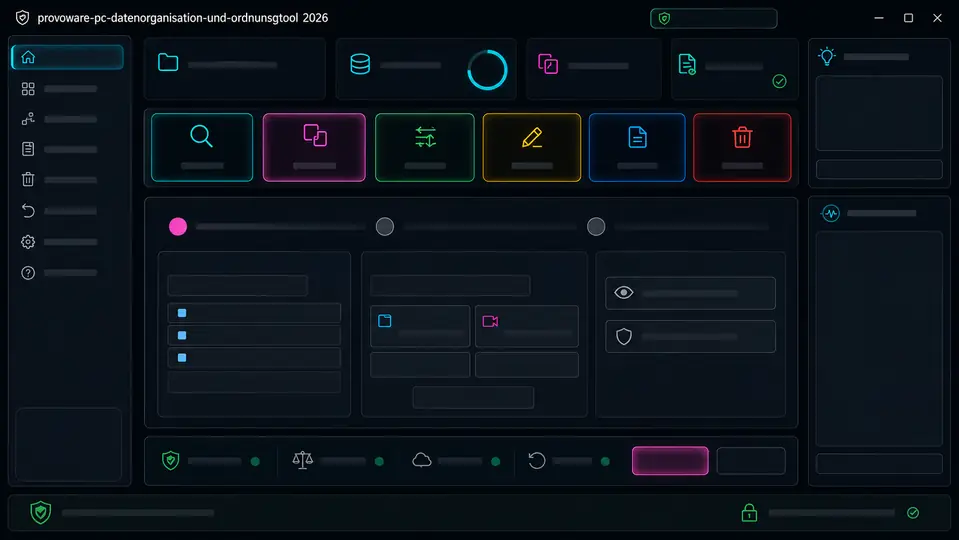

# MULTIMODULTOOL2026

> **Entwicklungsfortschritt: 36 %**  
> **Erledigte Punkte: 23**  
> **Offene Punkte: 41**  
> **Gesamtpunkte: 64**  
> **Aktuelle Phase:** zentrale Fehler- und Ereignisschicht mit Failpoint-geprüften Einstellungstransaktionen  
> **Letzte Fortschrittsprüfung:** 2026-08-04

> **Plattformvertrag:** Dieses Projekt wird ausschließlich für Linux-Desktop-Systeme entwickelt. Primäre Zielsysteme sind Kubuntu 22.04 LTS und Kubuntu 24.04 LTS. Windows, macOS, Android und iOS gehören nicht zum Entwicklungs-, Test- oder Releaseumfang.

MULTIMODULTOOL2026 ist ein lokal arbeitendes Linux-Desktop-Werkzeug zur sicheren Analyse, Organisation, Benennung und Wiederauffindbarkeit großer Dateisammlungen. Produktive Dateioperationen bleiben gesperrt, bis Papierkorb, Undo, Single-Instance-Schutz und Wiederanlauf vollständig geprüft sind.

## Schnellstart unter Kubuntu

```bash
chmod +x start.sh setup.sh
./start.sh
```

Fehlen Python-Komponenten, `.venv` oder PySide6, startet automatisch der geführte Einrichtungsassistent. Unter KDE verwendet er nach Möglichkeit KDialog; andernfalls einen klaren Terminaldialog.

Nur Einrichtung prüfen:

```bash
./setup.sh --check-only
```

## Aktuell startbarer Stand

Vor dem GUI-Start werden geprüft:

1. Linux-Plattform und lokale Python-Umgebung,
2. `layout-manifest.json` und die neun Layoutzonen,
3. XDG-Pfade und private Rechte `0700`,
4. versionierte Einstellungen und Dateirechte `0600`,
5. das zentrale Ereignisjournal im XDG-Logpfad.

Beschädigte Einstellungen werden isoliert und aus der letzten gültigen Sicherung oder sicheren Standardwerten wiederhergestellt. Recovery und Fehler werden in einen einheitlichen Nutzervertrag übersetzt.

## Zentrale Fehler- und Ereignisschicht

Jeder globale Fehlerdialog zeigt vollständig:

- **Ursache**
- **Folge**
- **Datenstand**
- **Lösung**
- **Diagnosekennung**
- **Sicherer nächster Schritt**

Erfasst werden unbehandelte Hauptthread-, Worker- und Qt-Ereignisausnahmen, Manifest-/XDG-Fehler, Einstellungs-Recovery sowie spätere Dateioperationsfehler. Kann die GUI nicht geladen werden, erscheint derselbe Vertrag in der Konsole.

Das private Ereignisjournal liegt unter:

```text
~/.local/state/multimodultool2026/logs/events.jsonl
```

Die Datei verwendet `0600`, wird mit `fsync` geschrieben und akzeptiert keine Symlinks. Benutzerpfade werden reduziert; typische Token-, Passwort-, Secret- und Bearer-Muster werden entfernt. Details: [`docs/FEHLER_UND_EREIGNISVERTRAG.md`](docs/FEHLER_UND_EREIGNISVERTRAG.md).

## Failpoint-geprüfte Einstellungen

Die Einstellungstransaktion wird an zehn künstlichen Unterbrechungspunkten geprüft:

- vor/nach temporärem Schreiben,
- vor/nach Datei-`fsync`,
- vor/nach Backup,
- vor/nach `os.replace`,
- vor/nach Nachvalidierung.

Für jeden Punkt muss `settings.json` entweder die vollständige alte oder die vollständige neue Konfiguration enthalten. Sicherungen bleiben schema-gültig, temporäre Dateien bleiben nicht zurück.

Aktive Einstellungen:

```text
~/.config/multimodultool2026/settings.json
```

Letzte gültige Sicherung:

```text
~/.config/multimodultool2026/settings.last-valid.json
```

## Rein lesende Diagnose

```bash
python3 -m src.main --validate-only
python3 -m src.main --paths-only
python3 -m src.main --settings-only
python3 tools/validate_repository.py
```

Die drei `src.main`-Diagnosemodi dürfen keine Verzeichnisse oder Dateien anlegen oder verändern.

## Automatische Prüfungen

```bash
python3 -m unittest discover -s tests -v
QT_QPA_PLATFORM=offscreen python3 -m unittest tests.test_gui_offscreen -v
```

GitHub Actions prüft bei Push und Pull Request:

- Repository-, Plattform- und Dokumentationsvertrag,
- Manifest, XDG-Pfade und Einstellungen,
- Fehler-/Ereignisvertrag und Failpoint-Matrix,
- Python-Syntax und JSON,
- sämtliche Standardtests,
- PySide6-Offscreen-GUI-Test einschließlich globalem Fehlerdialog.

## Sichere XDG-Pfade

- Konfiguration: `~/.config/multimodultool2026`
- Nutzerdaten: `~/.local/share/multimodultool2026`
- Cache: `~/.cache/multimodultool2026`
- Status: `~/.local/state/multimodultool2026`
- Logs: `~/.local/state/multimodultool2026/logs`
- Sicherungen: `~/.local/share/multimodultool2026/backups`

Verträge:

- [`docs/XDG_PFADVERTRAG.md`](docs/XDG_PFADVERTRAG.md)
- [`docs/EINSTELLUNGSVERTRAG.md`](docs/EINSTELLUNGSVERTRAG.md)
- [`docs/FEHLER_UND_EREIGNISVERTRAG.md`](docs/FEHLER_UND_EREIGNISVERTRAG.md)
- [`standards/settings-schema-v1.json`](standards/settings-schema-v1.json)

## Linux-Zielumfang

Unterstützt und verpflichtend zu testen:

- Kubuntu 22.04 LTS, x86-64
- Kubuntu 24.04 LTS, x86-64
- KDE Plasma unter X11 und Wayland
- Fenstergrößen von 1024 × 680 bis 4K

Nicht Teil des Projekts:

- Windows-Installer oder Windows-spezifische Pfade
- macOS-App-Bundles
- Android- oder iOS-Versionen
- Browser-, PWA- oder Web-App-Ausgabe

## Visuelle Leitvorlage



Grundaufbau, Zonenfolge und räumliche Logik bleiben bestehen, solange keine ausdrückliche Änderung verlangt wird.

Verbindliche Quellen:

- [`docs/UI_BASISVORLAGE.md`](docs/UI_BASISVORLAGE.md)
- [`standards/UI_LAYOUT_STANDARD_2026.md`](standards/UI_LAYOUT_STANDARD_2026.md)
- [`layout-manifest.json`](layout-manifest.json)
- [`AGENTS.md`](AGENTS.md)

## Pflichtdokumente

| Datei | Zweck |
|---|---|
| [`CHANGELOG.md`](CHANGELOG.md) | Änderungen je Iteration |
| [`ANLEITUNG_TOOL.md`](ANLEITUNG_TOOL.md) | Installation, Bedienung und Fehlerhilfe |
| [`TODO.md`](TODO.md) | priorisierte, prüfbare Aufgaben |
| [`SCHWACHSTELLEN.md`](SCHWACHSTELLEN.md) | Risiken und Gegenmaßnahmen |
| [`UPGRADE_POOL.md`](UPGRADE_POOL.md) | optionale Linux-Erweiterungen |
| [`ENTWICKLERDOKU.md`](ENTWICKLERDOKU.md) | Architektur und Prüfverfahren |
| [`docs/GITHUB_ZUGRIFF.md`](docs/GITHUB_ZUGRIFF.md) | externer Zugriffsvertrag |

## Aktuelle Grenzen

- Das Ereignisjournal besitzt noch keine Rotation oder Größenbegrenzung; dies folgt mit `P3-003`.
- Die physische Abnahme unter KDE Plasma, X11, Wayland und mehreren DPI-Stufen bleibt offen.
- Produktive Dateioperationen sind weiterhin deaktiviert.
- Der direkt folgende technische Schritt ist `P0-005`: Linux-Single-Instance-Schutz mit sicherer Übergabe weiterer Startaufrufe.
